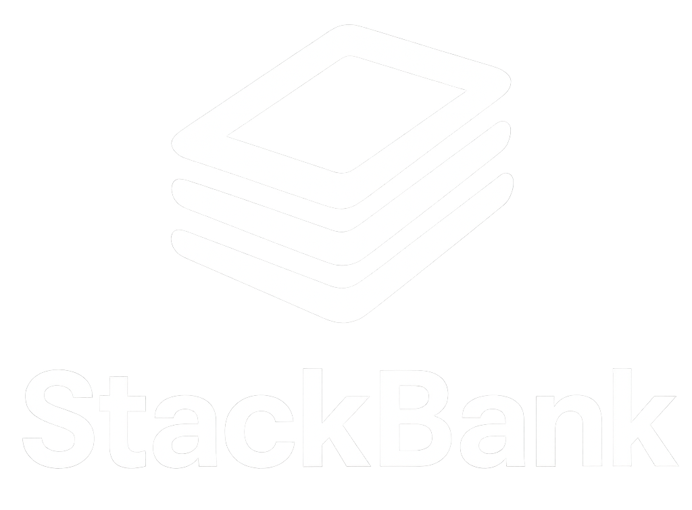

# 

# StackBank Demo App

A full-stack demo banking application simulating basic banking operations. This project is for demonstration and educational purposes only and is not intended for production use.

---

## Features
- Modern React frontend
- Node.js/Express backend
- Demo data for banking operations
- Protected routes for authenticated access

---

## Prerequisites
- [Node.js](https://nodejs.org/) (v16 or higher recommended)
- [npm](https://www.npmjs.com/) (comes with Node.js)

---

## Installation

### 1. Clone the repository
```bash
git clone <repo-url>
cd stackbank-bank-demo-app
```

### 2. Install backend dependencies
```bash
cd backend
npm install
```

### 3. Install frontend dependencies
```bash
cd ../frontend
npm install
```

---

## Running the Application

### 1. Start the backend server
```bash
cd backend
npm start
```
By default, the backend runs on [http://localhost:3001](http://localhost:3001)

### 2. Start the frontend app
Open a new terminal window/tab:
```bash
cd frontend
npm start
```
The frontend runs on [http://localhost:3000](http://localhost:3000)

---

## Folder Structure
```
stackbank-bank-demo-app/
  backend/           # Node.js/Express backend
    data.json        # Demo banking data
    index.js         # Backend entry point
    package.json     # Backend dependencies
    frontend/public/ # (Legacy assets, not used by main frontend)
  frontend/          # React frontend
    public/          # Static assets (including StackBank logo)
    src/             # React source code
    package.json     # Frontend dependencies
  README.md          # This file
```

---

## Notes
- The StackBank logo is for demonstration purposes only.
- This project is not affiliated with or endorsed by StackBank.

---

## Contributing
Pull requests are welcome! For major changes, please open an issue first to discuss what you would like to change.

---

## License
[MIT](LICENSE)
